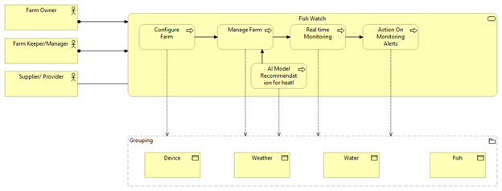
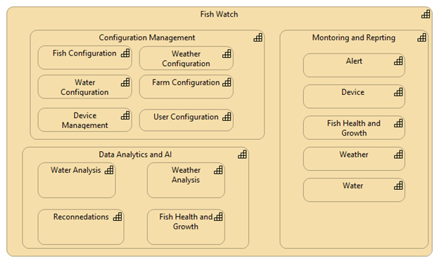
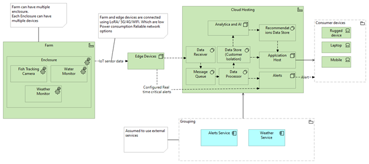

Contents

# I. Overview

**Livestock Insights Incorporated** is a company headquartered in Scotland.

Their main service offering, **Fish Watch**, is used by Fish Farmers around the world to monitor their fish, and the fish farms in general. They provide services ranging from small fish farmers to very large-scale fish farmers.

# II. Vision

**Help fish farmers to maximise fish harvest.**

# III. Goals and Opportunities

## Immediate Business Goals

- Maximise fish harvesting by continuous monitoring and Safeguard against odd conditions using AI capability and timely alerting
- Provide services to small to very large scale fish farmers
- Support multiple UI devices– rugged devices, mobiles and Laptops

## Long Term Business Goals

- System should be flexible to support cattle, and aquariums etc in future
- Regularly enhance AI model to support better recommendations
- Blockchain can be explored to ensure traceability and transparency in the fish supply chain

## Business Opportunity

- Growing market of fish farming can benefit from AI model recommendations and will give opportunity to grow Organisation.
- Product usage by small and large scale will give wider reach for organisation growth.
- Subscription based revenue Model.
- Automated treatment for closed enclosures(aquarium)

# IV. Stakeholders

- Farm Owner
- Farm Manager/Keeper
- Supplier

# V. Use Cases

## Farm Configuration

Farms, enclosures, and devices will be defined.

## Manage Farm

Continuous monitoring, Planning & Scheduling for harvesting.

## Real Time Monitoring Actions

Changes/actions based on raised alerts.

# Functional Requirements

1. Configuration Management
    1. Farm (Enclosure, devices like Camera and sensors)
    2. Fish (Species, Parasites etc.)
    3. Water
    4. Users
    5. Weather
    6. Alerts
2. Data collection about individual fish, water quality, and weather.
    1. Water quality information including PH, temperature, salinity, oxygen levels and other factors.
    2. General view of fish health, looking at size, activity, and whether parasites are detected.
    3. Weather
3. Data Analytics and AI
    1. Livestock health
    2. Recommendations like Best time to harvest, Parasite control, Fish Lifecycle
    3. Alert generation
4. Provide Dashboard about each farm (AI recommendations and Management)
    1. Livestock health
    2. Fish Lifecycle
    3. Device Management
    4. Alerts (Weather, Water, Health)
    5. Recommendations like Best time to harvest, Parasite control, Fish Lifecycle
5. Provide alert (SMS/EMAIL/Call) on
    1. Fish
    2. Weather information
    3. Water condition
    4. Devices

# Non-Functional Requirements

1. Resilient alerting system. Near real time alert is required (to manage low/no network)
2. System should be able to support small and large farm. Small farm may have up to 10 enclosures. Large farm may have up to a thousand or more. Biggest farm may have over a million fish.
3. Customized solution to support multiple devices, to reduce onboarding of new clients.
4. Compliance to Local Governance (Data, Environment etc.)
5. Infra and Data Support
    1. Multi-Tenant (For small farmers) vs dedicated Model (for large farmers)
    2. Data Retention
    3. Security
6. System should be 24\*7 available.
7. Systems should be scalable to support business growth

# VI. Architectural Requirements

Fish Watch needs to be accessible from several devices, including rugged industrial devices used on the sea during harvest.

## Prioritized Architecture Characteristics

### Accessibility

Application will be available on multiple user devises like Mobile, Laptop and rugged devices as per device capability.

### Security

Application will be accessible to authorised users only.

Data access is controlled and stored in isolation.

Devices should be secured patched timely.

### Scalability, Durability, Availability, Extensibility, Geography

System will use Cloud features like Load Balancers, flexible Storage &capacity, message Handlers etc.

# VII. RAID

## Risks

- Weather conditions like Storms, Earthquake etc for devices and Fish
- Unknown scenarios like diseases, water adulteration etc. which cannot be detected by existing setup

## Assumptions

- Powerful devices will enhance data collection in future.
- Hardware devices to capture water information and detect fish behaviour already exist.
- Devices will be long duration self-powered.
- Marketing and Logistics are out scope.
- Automated Fish feeding is out of scope.
- Blockchain solution is out of scope.
- Premise Security is out of scope.

## Issues

- Fish farms are often in remote locations, where cellular signal may be poor

## Dependencies

- Initial high Investment cost

# VIII. High-Level Architecture

## Journey

 

## Capabilities

 

- System to be flexible to consider providing similar capabilities to cattle and allowing aquariums to use the system to look after fish health.
- Customer will have choice to share their own data for AI Model learning.
- AI Model will learn from Available global data (with Farmer consent) collection and will provide local recommendations (specific to farm).
- Systems will provide different subscriptions for AI Recommendations (e.g. Basic, Advanced and Premium)
- Hardware consumption using Lease vs Purchase. Small farms can go for lease, while large can opt lease/Purchase.
- Production planning and Scheduling can be managed based on recommendations.

## Physical

 

- Data is secured during transit and Rest using encryption.
- User Interface will be created for different devices – Laptops, Mobiles, rugged devices. All features will not be available on all devices. Response Design will be used to cater rendering on different formats.
- Fish-ual recognition will be used for parasite and species.

# IX. ADRS

## ADR 1. Network Connectivity

### Status

Proposed

### Context

Resilient network connections

### Decision

Sensors need to be connected to edge devices using low power consumption network options (like LoRA/5G/4G/WIFI/BLE) and the edge devices be connected to Cloud Network for Data storage and processing. Even in case of no network, edge devices would be able to process real time data to generate critical alert on devices connected locally.

### Consequences

Improved network connectivity. Real time response will not be possible, but this will provide near real time network.

Real time alert would be possible, but limited by available analytic capability installed locally, which can be updated based on network availability or manually using packages.

## ADR 2. Redundant Power supply

### Status

Proposed

### Context

Redundant power supply to be arranged.

### Decision

Power supply to be done using batteries, Solar and other possible options.

### Consequences

Redundant power supply and minimal power consumption devices will ensure system availability.

## ADR 3. Cloud hosting to be used (AWS Preferred)

### Status

Proposed

### Context

Solution will be hosted on cloud preferably AWS.

### Decision

Solution will be hosted on Cloud in different geolocation for DR purpose.

### Consequences

This will support Architectural requirements like Scalability, Durability, Availability, Extensibility, Geography and Security.

## ADR 4. Data Governance and Security

### Status

Proposed

### Context

Customer will have provision to share /not share data for Model Learning.

### Decision

Customer to have control for data for sharing for modelling.

### Consequences

This will support Customer experience and Data security and Local data Governance to specific geographies.

## ADR 5. Data Formats

### Status

Proposed

### Context

Data storage will be independent of Sensor data formats.

### Decision

Data storage will be independent of Sensor data formats.

### Consequences

This will help to be device (sensors, cameras) agnostic and it will be easy to change supplier in future.
